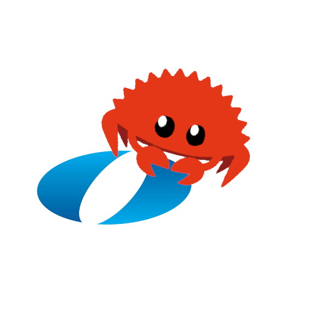

# ASP(i)RIN

Student Repo for Advanced System Programming in Rust

## About
ASP(i)RIN is a brand-new, student designed and taught programming course at [Olin College of Engineering](olin.edu). A continuation to [ENGR3525 Software Systems](softsys.olin.edu), We want to take an approach to a software class that is less common at Olin. Instead of hitting the highlights of a lot of different subjects, we’ll take a few systems topics and dive deep into them, comparing and contrasting different theories and methods of tackling these problems presented by different languages and analyzing the trade-offs made between them.

The goal of this approach is instead of broadening the list of topics you are exposed to, we want to strengthen your computational thinking and software architecture skills so that even if you never touch Rust or software systems again, you’ll be able to apply the principles from this class to writing safer, more robust programs in any context.
We’re also workshopping some cool projects for the class, which include things like a command line tool, a multithreaded server, a custom device driver, and an open-ended final project.

## Links
 
Our full syllabus and course description is available [here](tinyurl.com/aspirin-syllabus)

Questions? Reach out to Amit KH '25 or Ayush Chakraborty '25

