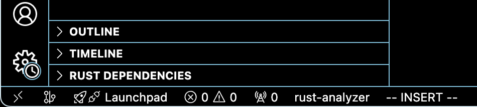

# Assignment 0: Hello Rust!

The purpose of this assignment is to allow you to get your feet wet with a few
introductory exercises. Along the way, you will learn how to do the following:
- Performing basic setup that will be necessary for the course
- Writing and running basic programs in Rust.
- Formatting and testing your code.
- Submitting your assignments via Git and Canvas.

## 0. Setup
This section is intended to help you get rust up and running on your local machine. NOTE: Officially, this course only supports a native Ubuntu 24.04 installation. However, it is certainly possible to get this setup running on other machines. Feel free to reach out on the discord if any issues arise.

### 0.1. Rust Installation
Installing rust is fairly straightforward. All you need to do in run the following command:

```bash
curl --proto '=https' --tlsv1.2 https://sh.rustup.rs -sSf | sh

```

To confirm that the installation was successful, run `rustc --version` outputs `rustc 1.80.1 (3f5fd8dd4 2024-08-06)`. Consult the [official rust book installation guide](https://doc.rust-lang.org/book/ch01-01-installation.html#installation) for more details.

### 0.2. IDE Setup
We recommend installing rust-analyzer in the development environment of your choosing (list of supported environments can be found [here](https://rust-analyzer.github.io/manual.html#vs-code)).

For VSCode, simply go to Settings -> Extensions and search for `rust-analyzer`. 

To confirm that the installation is successful, open a rust project (ex: 00-hello-rust) and confirm that `rust-analyzer` is at bottom left of your screen (example attached)



## 1. Barking up the Wrong `Branch`
This course will follow the same branching strategy for submitting assignments as SoftSys. You should make your own fork of the `aspirin-2024-03` repository.  

### 1.0. Sync Up
Before making a new branch, always make sure the `main` branch of your fork of the ASPRIN repo is up to date. To do this, in the command line, navigate to your ASPRIN repo and run the following commands:

```bash
git switch main # Make sure you are on the main branch
git pull    # Sync your local clone with the remote of your fork of the course repo
git pull upstream main # Sync up with upstream course repo
```

Ensure that each command runs successfully, and handle any merge conflicts as needed.

### 1.1. Create a New Branch
To see the current branches that you have, along with the current branch that you are on, run the following command:

```bash
git branch -a
```

You can also use `git branch` to create new branches. This branch will be absed on the current branch that you are on. You should create a new branch for each assignment you are working on. For example, to create a branch for this assignment, run the following command in your local copy of your repo:

```bash
git branch assignment-00
```

### 1.2. Switch to the New Branch
Once you have created the `assignment-00` branch, run the following command to switch to it:

```bash
git switch assignment-00
```

You can also run `git switch -c assignment-00` in order to create and switch to the branch in one command.

## 2. Documentation
Before jumping into writing rust, it is helpful to learn about how to properly comment your code. In rust, there a two types of comments: regular comments and doc comments.

### 2.0. Regular Comments
Regular comments are comments ignored by the compiler and are typically used within functions to describe blocks of code and to temporarily remove lines of code. 
```rust
// Double forward slashes signify single-line comments
/* Block comments can be used within the middle of a line of code, or for multi-line comments */
```

Checkout this [link](https://doc.rust-lang.org/rust-by-example/hello/comment.html) from the rust book for more detailed examples.

### 2.1. Documentation Comments
Documentation comments, similar to docstrings in python, are used to for file-level and function-level comments. 

```rust
//! This file is intended to be an example of how to document code

/// Adds the two inputted u8s together.
fn add_uints(x: u8, y: u8) -> u8 {
    x + y
}

/// The main function that prints the result of adding 4 and 5
fn main() {
    println!("The sum of 4 and 5 is: {}", add_uints(4, 5));
}
```

Checkout this [link](https://doc.rust-lang.org/rust-by-example/meta/doc.html) foor more detailed examples.

You can also include examples (and tests!) in your function docstrings. Read [here](https://doc.rust-lang.org/rustdoc/write-documentation/documentation-tests.html) for more information.

The really nice thing about documentation comments in rust is that you can autogenerate HTML pages that serve as full API references for your crate. This can be generated by running the following command:

```bash
cargo doc --open
```

### 2.2. Your Turn

As the first part of the assignment, you should verbosely document the `guessing_game.rs`. Include the following:
- A document comment describing the purpose of the file.
- Document comments for each function.
- In-line comments describing significant logic within functions.

## 3. Polishing off the Rust
After a long summer, your coding skills might be a little *rust*y. This section will help you dust off some of those cobwebs, while also letting you get your feet wet with writing your first few rust scripts.

### 3.0. Fizz Buzz
Starting off strong, the first coding problem is the classic, Fizz Buzz. In `fizz_buzz.rs`, you are given one function `print_fizz_buzz` that you need to implement. This function takes in one parameter, `max_num: u32`. Within this function, you need to print out all numbers between 1 and `max_num` (inclusive). However, if the number is a multiple of 3, print out Fizz and if the number is a multiple of 5, print out Buzz. If both are true, print out FizzBuzz.

For example, this function call
```rust
print_fizz_buzz(15)
```

should yield the following text to `stdout`
```bash
1
2
Buzz
4
Fizz
Buzz
7
8
Buzz
Fizz
11
Buzz
13
14
FizzBuzz
```

### 3.1. *Red*y for Action?
Your local transportation authority has recently been dealing with memory issues in their traffic light control algorithms. For this reason, they asked you, the local rust expert, to re-implement their algorithm in, you guessed it, rust!

In order to do this, we have provided you with some starter code in `traffic_light.rs`.

`TrafficLightColor` represents all the possible colors that can be visible from the traffic light.
```rust
enum TrafficLightColor {
    Red,
    Yellow,
    Green,
}
```

`TrafficLightState` represents the current state of a given traffic light. It tracks the current color being shown to drivers and the timestamp (in milliseconds) at which the traffic light transitioned to this color.
```rust
struct TrafficLightState {
    current_color: TrafficLightColor,
    last_transition_time_ms: u32,
}
```

#### 3.1.0 Color Factory
First, you need to implement `get_next_color`. This function takes in the current state (represented as a `TrafficLightState`) and determines what the next color of the traffic light should be. The transitions are as follows:

| Current Color    | Next Color |
| ---------------- | ---------- |
| Red              | Green      |
| Yellow           | Red        |
| Green            | Yellow     |

#### 3.1.1
Now that you know which color comes next, you need to determine when is the appropriate time to switch colors. This will be implemented in `get_next_state`. Since we don't want to be continuously changing colors, there is a minimum amount of time that we need to hold each state, represented below:

| Color    | Required Time (ms) |
| ---------------- | ---------- |
| Red              | 25000      |
| Yellow           | 5000        |
| Green            | 30000     |

However, there's one catch. the local town would like to encourage more pedestrians, so they would like to clear the walkway faster when a pedestrian is detected. So, if a pedestrian is detected when the traffic light is green, only maintain the green state for 20 seconds rather than 30.

Before moving to the next exercise, ensure that all of your unit tests pass. You can run the traffic light unit tests through the following command:

```bash
cargo test src/traffic_light.rs
```

### 3.2 Show Some *Class*
Olin College has recently been working on storing data about their students (ethically of course). In `university.rs`, someone has already started this task. The `Student` struct, has been declared, which stores all the relevant metadata necessary about each student.

```rust
struct Student {
    name: &'static str,
    class_year: ClassYear,
    gpa: f32, 
}
```
For now, you don't need to worry about the lifetime (static) on `str`, this will be covered in Week 2. If you are curious, take a look at [this](https://doc.rust-lang.org/book/ch10-03-lifetime-syntax.html) page.

Additionally, there is an enum to represent the 4 different class years that a student can be.

```rust
#[derive(PartialEq, EnumIter, Clone, Copy)]
enum ClassYear {
    Senior,
    Junior,
    Sophomore,
    FirstYear,
}
```

Additionally, the current students (prior to the class of 2028) have already been populated into an array, `OLIN_STUDENTS`. Your job is to expand upon this infrastructure to get a better understanding of the college.

#### 3.2.0 New Students
In preparation for the new school year, you need to add in all the members of the incoming first-year class. Luckily for you, Olin is trying to solve the existing housing crisis, so they only admitted 2 new first years, Anna and Hannah. Since they're both first years, they have a default GPA of 4.00.

Additionally, Olin has a new exchange student, Lorin. Based on his past credits, he is considered a Junior and has a transfer GPA of 3.6.

You should add all three of these students to the `OLIN_STUDENTS` array.

#### 3.2.1 Average GPA
US News is calling, they need to know the average GPA of an Olin Student. In the past, this meant that one unfortunate student worker needed to pull out a calculate and manually compute this average, but now, thanks to you, it can be automated!

In `university.rs`, implement `get_average_gpa`, which computes and returns the average GPA of all the students in `OLIN_STUDENTS`. You should ignore all first year GPAs, since they are simply default values and not actual GPAs.

#### 3.2.2 Olin's Best Class
People are raving about the automated student directory that you have made! Even the provost has heard about it, and now they have their own request. They want to determine the best Olin Class in order to increase their class budget and have tasked you with making this determination.

Specifically, the provost would like you to make this determination by yielding the class with the most "excelling" students. An excelling student is defined as a student with a GPA above the school's average GPA. 

Example:

Before moving on, make sure all of your unit tests pass. They can be run by running the following command:
```bash
cargo test src/university.rs
```

### 3.3. All About That Base
For the final part of this assignment, you will be creating a robust calculator. 

As a minimum, your calculator should be able to accept the following operations:
- Bitwise AND (&, AND, and)
- Bitwise OR (|, or, OR)
- Bitwise XOR (^, xor, XOR)

When parsing the input, your calculator should be able to accept either, the mathematical symbol for operator, or the (case insensitive) english representation for the operator.

Additionally, no advanced calculator is complete without support for multiple bases. At a minimum, your calculator should be able to accept the following bases:
- Decimal (no prefix)
- Hexadecimal (numbers are prefixed with 0x)
- Binary (numbers are prefixed with 0b)

Helpful tip:
Algebraic types in rust already have helpful built-in functions for handling varying bases. For this particular application, we recommend taking a look at [`from_str_radix`](https://doc.rust-lang.org/std/primitive.u32.html#method.from_str_radix) for parsing.

Note: Even though it was acceptable to only implement the specified operations and numerical bases, your code should be written with scalability in mind such that new features can be easily integrated. (hint hint, enums!)

No starter code is provided for this section of the assignment. You are required to write unit tests to ensure that your calculator is working as expected. You are not required to test any function that interacts with stdin nor stdout, however all other behaviors must be tested. Primarily, this means that comprehensive test coverage must be present for each of the number bases and each operator that you are required to support.

Example Interactions:

1.
```bash
Please enter the first number:
12
Please enter the second number:
32
Please enter the desired operation:
XOR
The result of 12 ^ 32 is 44
```

2.
```bash
Please enter the first number:
0b10
Please enter the second number:
0b11011
Please enter the desired operation:
and
The result of 2 & 27 is 2
```

3.
```bash
Please enter the first number:
0xF8
Please enter the second number:
0x3A
Please enter the desired operation:
|
The result of 248 | 58 is 250
```

As a possible extension, you are welcome to format the result to be represented in the same base as the input argument (this is not required to do).

## 4. Polishing the Rust
Now that you've implemented your first rust functions, it's time to evaluate their correctness and quality. These steps are recommended for whenever you are writing rust, not just within this course.

### 4.0. Unit Tests
As with any successful project, you need to make sure all of the unit tests you've been provided (and written yourself) are passing. In order to run all the unit tests within a crate, run the following command:

```bash
cargo test
```

If you just wish to run the unit tests within a specific file, you can run:

```bash
cargo test <path-to-file>
```
Note: This might not always work based on what crates are being used to make test case generation easier.

You can also run specific test cases directly by name.
Ex:
```bash
cargo test university::tests::test_get_best_class
```

### 4.1. Formatting and Linting
As you may have noticed, lint warnings automatically show up as they are part of the build step. There is an additional linter, clippy, built into the rust toolchain to capture more common errors and improve code quality. Read [here](https://doc.rust-lang.org/clippy/) for more information. Clippy can be run through the following command:

```bash
cargo clippy
```

Rust also has a built-in formatter that can be run through the following command:

```bash
cargo fmt
```

In order to receive full credit for code quality, ensure that rustfmt and clippy produce no warnings.

## 5. Submit the Assignment
Now, you are ready to submit this assignment!

### 5.0. Commit Changes
Make sure that you are on the `assignment-00` branch. If not, you can switch to it by running `git checkout assignment-00`. 

Then, stage your changes via `git add` and commit those changes through `git commit -m <commit message>`. Ensure that your commit message is detailed and representative of the changes you are making. In all, you should be making changes to each file in the src directory.

### 5.2. Create Origin Branch and Push
Push your changes via `git push`. If you have not already established an upstream branch to track your changes. This can be done by runing `git push --set-upstream origin assignment-00`.

### 5.3. Open a Pull Request
In your fork of the course repository, navigate to the `Pull Requests` tab and select `New pull request`. Then, ensure that the base repository is `USERNAME/aspirin-20XX-YY`.

Then, select `main` as the base branch and `assignment-00` as the branch to compare against. You can then create the pull request.

Once you are ready for reviews, select the `olincollege/aspirin-2024-03-assistant` group as reviewers. and submit the PR link to the assignment 0 canvas assignment.